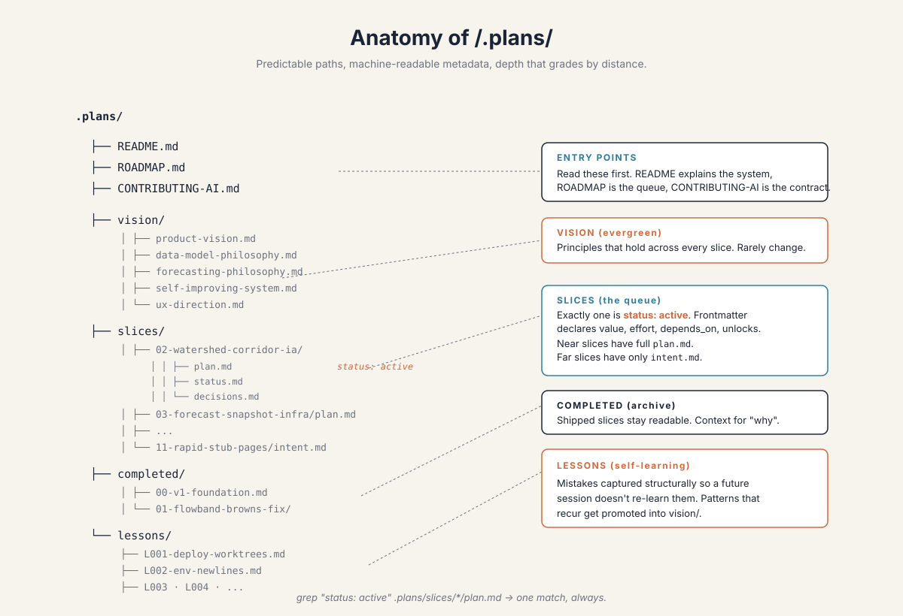
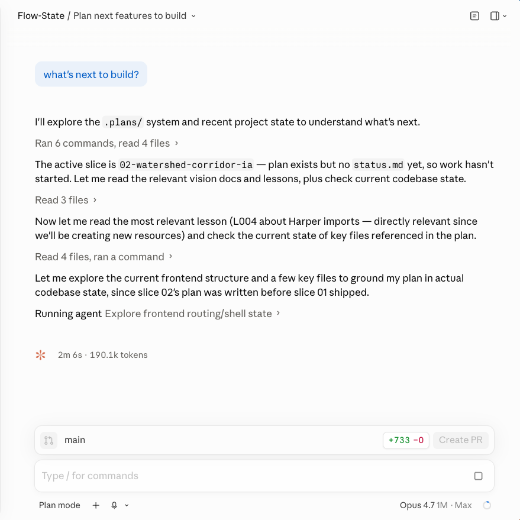

# The Repo That Builds Itself

### On getting a side project past 95%, and where Harper fits

---

Some Saturdays the planning ritual takes longer than the drive. I want to know whether Browns Canyon is going today, and the data exists — five different government agencies publish it, free, open, all of it sitting behind public APIs — but it lives across four ugly websites with four different layouts. I hold the comparison in my head against thresholds I half-remember from three summers of guiding the river fifteen years ago, give up somewhere around the third tab, and just drive out.

As a guide you learn to read a river fast, but you also learn the boring parts. Which release schedule matters this week. Which gauge actually maps to your section. Whether last week's snowmelt is still moving downstream. The federal APIs have most of the raw material for all of that. They just don't have any of it in one place. That's the proximate thing Flow-State is meant to fix. The actual problem with Flow-State is more interesting.

I work in tech now, building apps at Harper. A few weeks ago, after one of those mornings, I sat down on a [two-hour livestream](https://www.youtube.com/live/RLT8w5udT04) and built the first version. By the end of the stream the thing on screen looked startlingly close to a finished product, and I said into the microphone, more or less: *this looks 95% complete, but it's really 95% of the work that's left.* That sentence has been the operating principle ever since.

The first 5% of building has gotten very cheap. AI assistance, fast scaffolding, free APIs: you can put a working prototype on screen before you go to bed. The 95% that comes after is the part that decides whether the prototype turns into a tool a stranger trusts for a real decision. That gap is what quietly defeats most MVPs and side projects in the agentic-coding era. It isn't crossed by coding harder. It's crossed by structure.

---

## The state problem

If you've spent any time working with AI coding agents, you've felt the bottleneck. Every new conversation starts cold. If the project's memory lives in chat, it dies with the chat. The next session re-derives what you already paid for, re-stumbles into pits you already crawled out of, re-debates decisions you already made. You can build the first 5% of three projects in three evenings and never push any of them past 95%.

The fix is that the repo has to be where the memory lives. Inside the codebase itself, in a form that a fresh session can pick up cold.

In Flow-State, that memory is a directory called `.plans/`, sitting next to the source code, in the same git history. It has a small set of subfolders. `vision/` for principles that hold across all work. `slices/` for the actual work queue, one folder per unit. `completed/` for slices that have shipped. `lessons/` for things the project has learned the hard way.

Three rules hold it together. The slices are a queue, not a list: exactly one is ever marked active. Detail grades by distance — the active slice has every file path and every acceptance criterion, while a slice four or five spots out is allowed to be a paragraph called `intent.md` naming what success looks like. And the project learns. Surprises become lessons, lessons become principles. Nothing important sits buried in commit messages.

The detail gradient is the part I underestimated when I designed this. The classic mistake in project planning is to specify everything up front; six months later the spec references functions that don't exist, the file paths have moved, and readers trust it while it lies to them. `.plans/` flips the gradient. A slice four or five spots out is vague on purpose. When it gets pulled to the front, a fresh session expands it into a real plan against the codebase as it actually is, not the codebase someone imagined the night they wrote the intent.

The lessons directory is the other one. Every codebase has a graveyard of forgotten gotchas: the deploy that almost worked, the query that returned the wrong number of rows on a Tuesday. `.plans/lessons/` is where I put them now, in a fixed template (wrong assumption, how it manifested, the right model, how to recognize it, mitigation). The repo's lessons file runs from L001 through L007. The canonical one is L004, about a Harper import quirk that ate a working evening after slice 01 shipped. Every session since touches the cache layer with that lesson on hand.

---

## The stack underneath

I work at Harper, so of course I'm building on Harper. The reason it actually fits, though, isn't loyalty. It's that the learning loop and the app are the same kind of data.

`GaugeReading` is append-only time series, a new row every fifteen minutes. `ForecastInput`, a learning table I'm adding next, is also append-only: every prediction snapshots its inputs at predict time. `ForecastAccuracy` records observed-versus-predicted flow once the window has passed. These are the same kind of row. Indexed, queryable, versioned. They live in one database, behind one REST surface, in the same git history as the markdown plans that decide what gets built next.

Harper is also a single runtime: one process, one deploy, the database and the API and the static host all in one place. That matters most during the build, when the messy middle 95% benefits from holding the app, its data, its memory, and its agent workflows in one store. What that looks like in practice: when I want to know why the last forecast missed, I hit the same REST surface I use to debug a stale dashboard, and the answer is one query away. Some of that consolidation won't survive a hardened production system, and that's fine. But while a project is still figuring out what it is, low-friction unification beats every alternative.

---

## Asking what's next

The part I didn't expect to like as much as I do is what this feels like day-to-day. I open a Claude Code session against the repo and ask the obvious question: *what's next to build?* The session reads `.plans/`, finds the active slice, pulls in any lesson that's likely to apply, checks the state of the codebase. A few minutes later, it has a recommendation.

The recommendation isn't always right. That's the interesting part.

The queue had slice 04 next — a driver-conditioned forecaster, the actual reason I built any of this. The session spun up to plan it. But I knew something the queue didn't. The project had started a few days earlier with no historical data; the ingestion worker had been collecting flow and snowpack readings since startup, but only since startup. Without thirteen months of history to compute baselines against, no forecaster was going to produce anything real. I told the session as much. *Before we go near forecasting, we need to backfill history.*

Ten minutes later the queue had a new slice in it: 03c, a thirteen-month backfill, with slice 04's dependencies updated to include it. The roadmap rendered the change. Slice 03b, which I was actually working on, stayed where it was. The whole thing was a short conversation. By hand it would have taken me an hour, and I would have forgotten to update some piece of it.

Tangents work the same way. *Actually, before we move on, the section detail page has a couple of UI issues I want to fix.* The system holds the structural plan; I supply the in-the-moment judgment. I don't have to remember which slice depends on which, which intents were written before what shipped, which lesson applies to what's about to break. The repo holds all of that.

That's the payoff. The system doesn't plan for me. What it does is take the plan out of my head, where it was always falling apart, and put it somewhere I can be reactive without losing the thread.

---

## Beyond a river app

Flow-State will be a real tool eventually. I want the next weekend boater debating Browns versus the Numbers to open one page, get a real answer, and skip the four-tab ritual. The pattern getting it there, though — the repo as its own project manager, the unified runtime underneath it — isn't really about rivers, or even about Flow-State.

It's about the bind that's catching a lot of projects right now. The livestream got the thing to 5%; modern tools made that part cheap. They don't close the 95% that follows. That part is structural: the memory has to live in the repo, the plan has to grade its detail by distance, and the lessons have to be written down somewhere a future session will find them. While a project is still figuring out what it is, a unified runtime is the easiest place to hold the whole apparatus together.

The first time I asked the system what to build next and it told me something useful, I thought: *huh, this is the thing.* That's been true for a couple of weeks now. The river is still cold. The four tabs are still ugly. The prototype has been getting steadily less embarrassing, the repo is doing some of the remembering, and I'm doing the judgment. It turns out that's enough to keep going.
